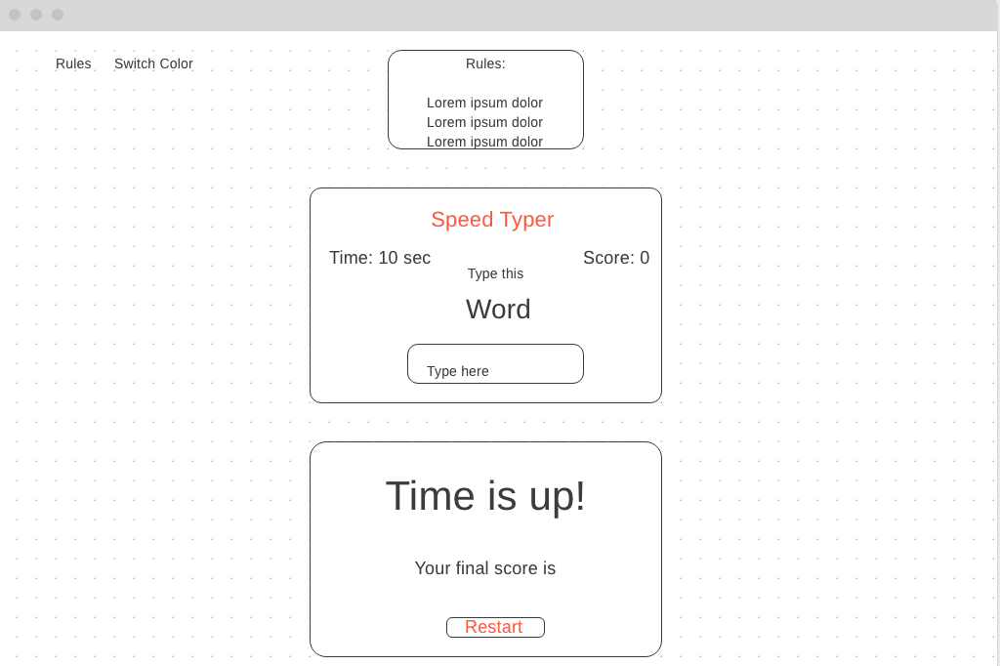
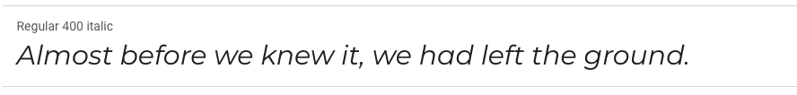
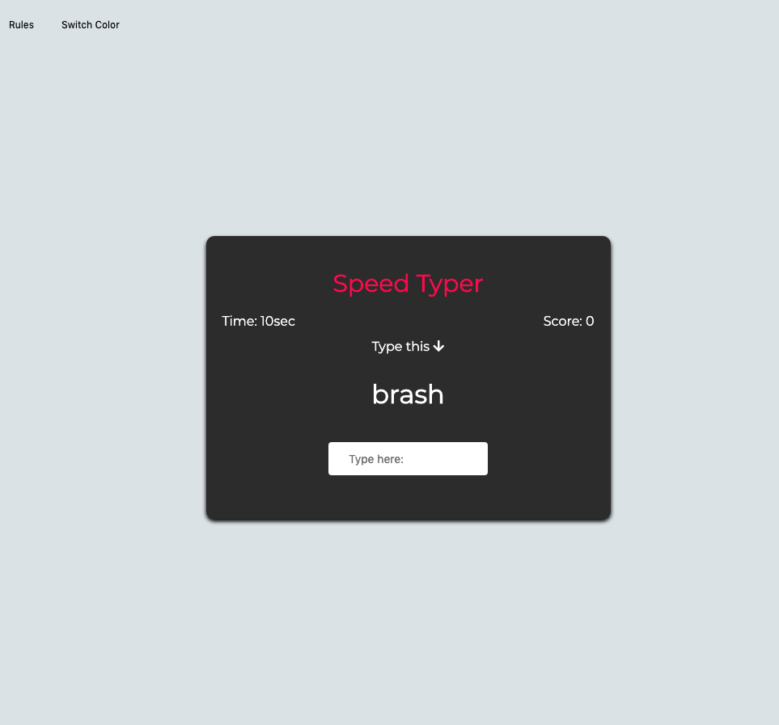
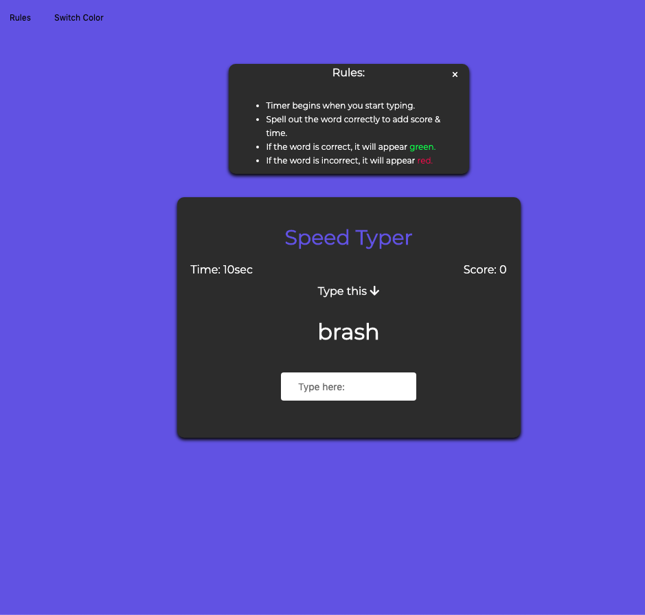
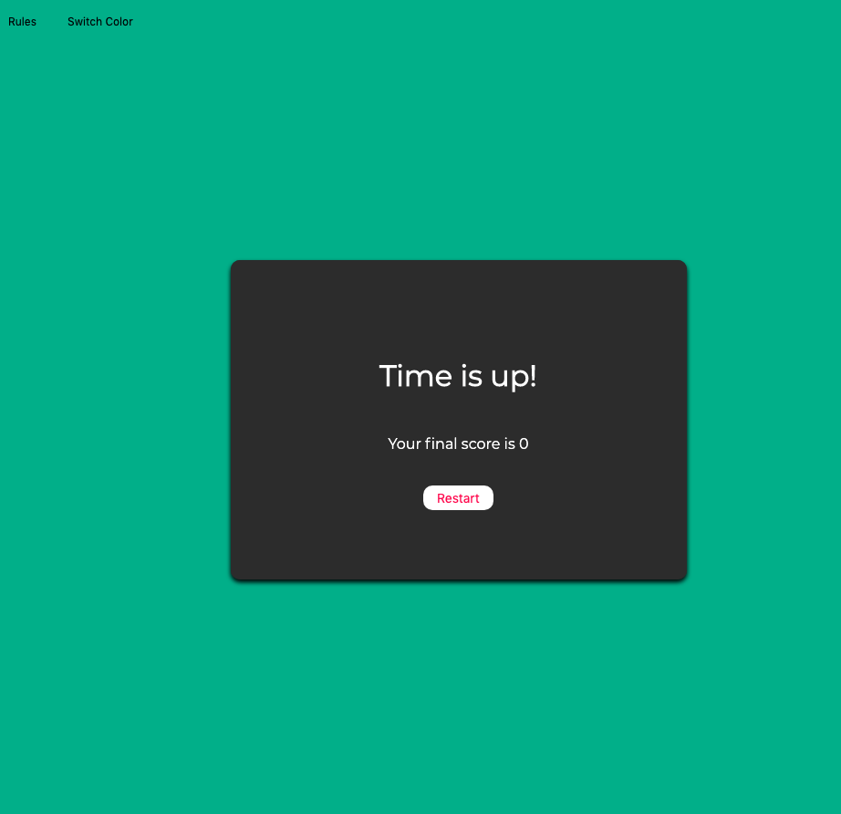

# Project-Zero

### User Stories:

- The game is a very simple version of a speed typing game. You get a random word to type in the input as fast as you can.
- We have a timer on a corner/side that will begin counting down from 10 secs.
- We have a score on the other side to keep track of it.
- Each time you finish typing a word it will add time to the timer. As well as the score will increase by 1.
- The goal is to type as many words as possible before the time is up.
- When the time is up there is a window with the total of your score.

### Wireframe

#### MVP
- ~~The game plays for 10 seconds.~~
- ~~The score goes up as the user types correct words.~~
- ~~Once the time is up have a display with final score.~~ 
- ~~Decent styling of UI~~

### Stretch Goals:

- ~~Start timer only when user starts typing.~~
- ~~Switch to different background colors.~~
- Add different difficulty levels.
- ~~Highlight correct & incorrect words.~~

### Font
The font i used is [Montserrat](https://fonts.google.com/specimen/Montserrat?query=mont "Montserrat") from [Google Fonts](https://fonts.google.com/?query=mont)

### Game UI 1

### Game UI 2

### Game UI 3

